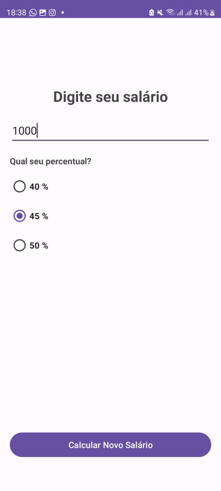
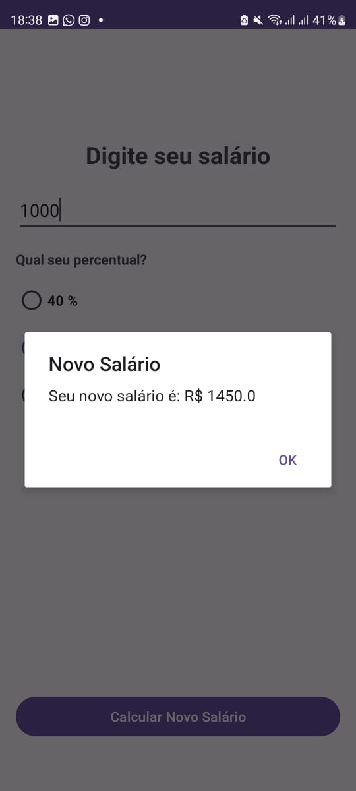

# Calcular adicional ao salário

**Resumo:**
O código representa um aplicativo Android para calcular um novo salário com base em um valor digitado pelo usuário e em uma porcentagem escolhida através de botões de opção. O aplicativo utiliza componentes como `RadioGroup`, `RadioButton`, `EditText`, e `Button`. Ao clicar no botão "Calcular", o código realiza a lógica de cálculo do novo salário, exibindo o resultado em um `AlertDialog`.

**Desenvolvimento do App:**
1. **Estrutura do App:** O aplicativo utiliza a arquitetura do Android, com uma classe principal chamada `MainActivity`.

2. **Interface do Usuário (UI):**
   - A interface do usuário é definida no arquivo de layout (`activity_main.xml`), onde os elementos como `EditText`, `RadioGroup`, e `Button` são declarados.
   - No código Java, as variáveis são inicializadas (`findViewById`) para interagir com esses elementos na atividade principal.

3. **Cálculo do Novo Salário:**
   - Um `OnClickListener` é configurado para o botão "Calcular", permitindo a execução de ações quando o botão é clicado.
   - O código obtém o valor digitado pelo usuário no `EditText` e tenta convertê-lo para um valor `double`, tratando exceções se a conversão falhar.
   - Identifica qual botão de opção (`RadioButton`) foi selecionado no `RadioGroup`.
   - Com base na escolha, calcula o novo salário adicionando a porcentagem apropriada ao salário original.
   - Exibe o resultado em um `AlertDialog` contendo o novo salário calculado.

4. **Tratamento de Erros:**
   - Um bloco `try-catch` é usado para lidar com possíveis exceções durante a conversão do texto do `EditText` para `double`.
   - Se ocorrer uma exceção, uma mensagem de erro é exibida no `EditText`.

5. **Interface de Usuário Gráfica:**
   - O novo salário calculado é apresentado em um `AlertDialog` com um título informativo e um botão "OK" para fechar a mensagem.

O desenvolvimento do aplicativo segue a prática padrão do Android, com ênfase na interação do usuário e tratamento de possíveis erros durante a entrada de dados.

---

---

[Professor Douglas](linkedin.com/in/douglas-dos-reis-3473a868), agradeço imensamente pelas suas aulas de Desenvolvimento Mobile Android. A experiência ao criar este aplicativo foi incrível, e sua orientação foi essencial. Estou muito grato por todo o aprendizado proporcionado.

Atenciosamente, Minoru